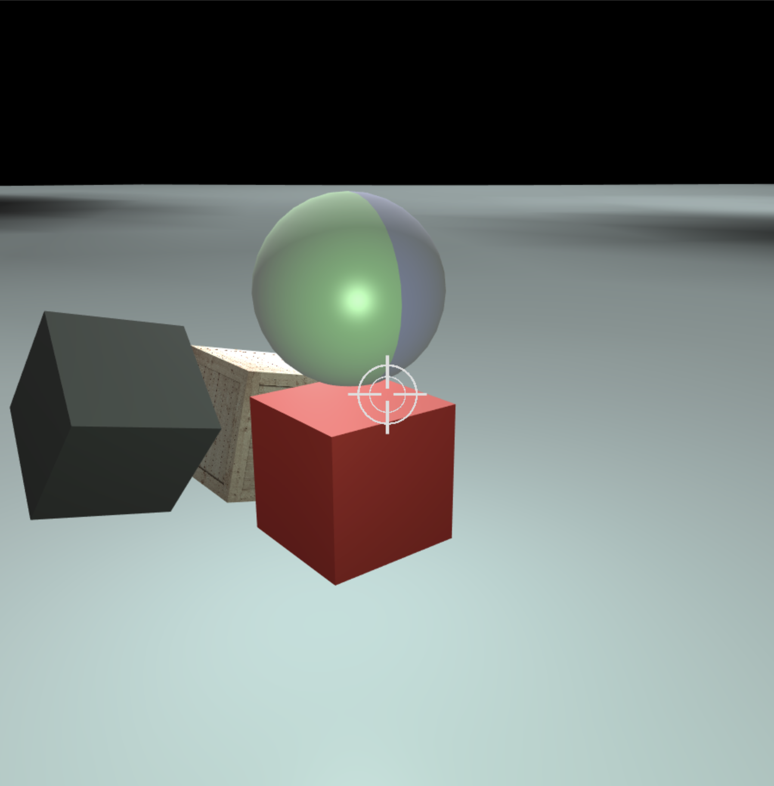

# Template WebGL project
## Introduction
Inspired by [this fantastic tutorial](https://www.youtube.com/watch?v=kB0ZVUrI4Aw&list=PLjcVFFANLS5zH_PeKC6I8p0Pt1hzph_rt), I am creating a template for 3D WebGL projects from scratch and avoiding as much as possible the use of external libraries.



## Description
### Shaders
There are two main shaders:

- 2D, for sprites (a textured quad), which are always located in front of everything else
- 3D, for all three-dimensional objects.

The 3D shader is modified at run time, depending on the presence of lights in the scene or if the texture is enabled.
Other shaders may be present for testing.

### Input devices
Due to the impossibility to capture the mouse pointer in a web application, only the keyboard is adopted as a controller.
The state of the keys in use is detected and stored by the XYZKeyboard class. The keys in use must be configured in a JSON file (in ```./etc/```) to specify what set of actions they perform and aliases for each key. The XYZKeyboard class loads and pareses such a JSON file.
The method updatePlayer() in the XYZNode class implements the actions.

### Players
There is only one keyboard handler but many objects can be defined as players, in which case they will all move synchronously.

### Meshes
Meshes are normally loaded from the ```assets``` folder where they must be saved as standard ```.obj``` files (in ```./assets/objects/```), along with their corresponding ```.mtl``` files (in ```./assets/materials/```). If present, texture files must be saved in the ```./assets/textures/``` folder. If a different path for the object file is specified, say ```<custom_path>```, the corresponding material and textures must be located in ```<custom_path>/../materials/``` and ```<custom_path>/../textures/```, respectively.

### Unit tests
Unit tests can be found in the ```./unit-test/``` folder.

### Extras
An installer file for MacOS is provided to setup the environment in a double-click.

## Instructions for Mac users
### Setup the project
- Clone repository
- run ```./install-mac```
### Run the WebGL application
- run ```./bin/run-all```
### Uninstall:
- run ```./bin/uninstall-mac```

# References:
## Math
[Euler angles from rotation matrix](https://www.gregslabaugh.net/publications/euler.pdf) - notice that psi and phi are swapped here compared to my function in the MatLab class.
